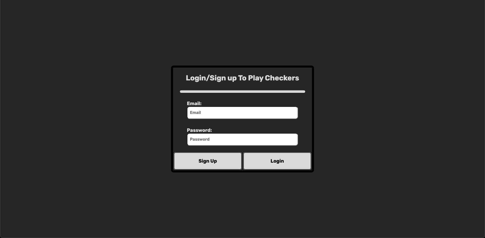
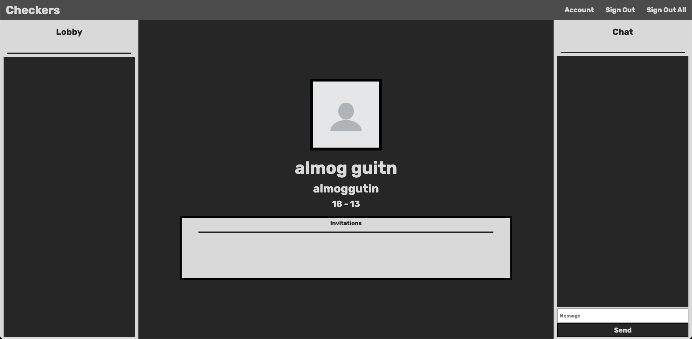
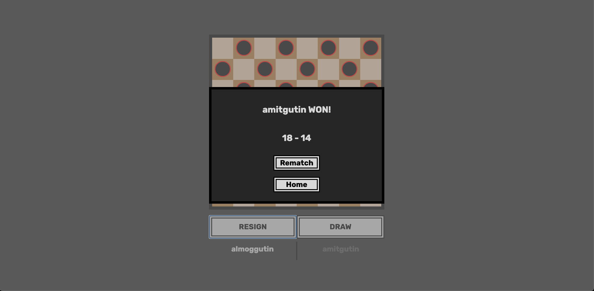

# { Checkers Game With Socket.io }

## < General />

This is a basic player vs. player Checkers game on the web for desktop and mobile.

This was wriiten with:

-   HTML5
-   CSS3
-   JavaScript
-   Socket.io
-   Libraries - express, cors, socket.io, and more...

## < Rules />

1.  **General rules-**

    1. The board is 8x8.
    2. 2 players- one has black pieces, one has white pieces.
    3. Players alternate turns.
    4. A player may not move an opponents piece.
    5. Only the dark squares are used.
    6. Capturing is mandatory.

2.  **Men-**

    1.  Uncrowned men move one step diagonally forwards, and in order to capture an opponents piece it needs to move two consecutive blocks in the same line, jumping over the opponents piece.
    2.  Multiple enemy pieces can be captured in a single turn provided this is done by successive jumps made by a single piece.
    3.  Men can jump forward not backwards.
    4.  You have to capture the opponents pieces.
    5.  If you don’t capture the opponents piece that same piece will be disqualified.

3.  **Kings-**

    1. A man is promoted to king when it reaches to the farthest row.
    2. Powers-
        1. Can move backwards.
        2. Can capture backwards.
        3. Can Make successive jumps in a single turn.
        4. The king can stop at any square after a jump in the same line.

4.  **Winning-** The game can end in a few way:
    1. Winning-
        1. The opponent doesn’t have any more pieces.
        2. The opponent resigned.
        3. The opponent has no available moves because his pieces are blocked.
    2. Draw-
        1. If after 15 consecutive moves only the kings moved, and the amount of pieces did not change.
        2. Draw by agreement.

## < Screenshots />

